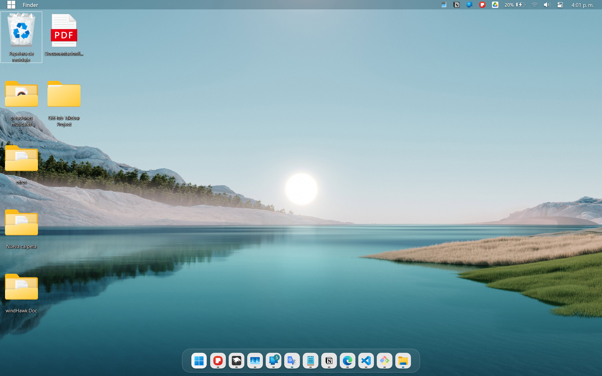

# Surface Theme for Windows 11 Taskbar Styler

**Author**: [Jimmy](https://github.com/JimmyLlancaMelo)

 \
 \
 \
 \


## Notes

* This theme is intended to be used with a status bar program such as "MyDockFinder", but can also be used without it.
* "MyDockFinder" has a dock built in, but it has certain limitations. This theme acts as an alternative to its dock.

## Required additional mod configuration

Mod: [Taskbar Height and Icon Size](https://windhawk.net/mods/taskbar-icon-size)

<details>
<summary>Content to import (click to expand)</summary>

```json
{
    "IconSize":24,
    "TaskbarHeight":70,
    "TaskbarButtonWidth":47
}
```
</details>

## Removing system tray

If you are using "MyDockFinder" you can hide the system tray with this style:

Target: `Grid#SystemTrayFrameGrid`
Style: `Visibility=Collapsed`

<!-- ## Theme selection

The theme is integrated into the mod, and can be simply selected from the mod's
settings:

* Open the Windows 11 Taskbar Styler mod in Windhawk.
* Go to the "Settings" tab.
* Select the theme and save the settings. -->

## Manual installation

The theme styles can also be imported manually. To do that, follow these steps:

* Open the Windows 11 Taskbar Styler mod in Windhawk.
* Go to the "Advanced" tab.
* Copy the content below to the text box under "Mod settings" and click "Save".

<details>
<summary>Content to import (click to expand)</summary>

```json
{
  "controlStyles[0].target": "Grid#RootGrid > Taskbar.TaskbarBackground > Grid",
  "controlStyles[0].styles[0]": "CornerRadius=20",
  "controlStyles[0].styles[1]": "BorderThickness=1",
  "controlStyles[0].styles[2]": "Margin=-20,0,-20,0",
  "controlStyles[0].styles[3]": "BorderBrush=#40FFFFFF",
  "controlStyles[0].styles[4]": "Padding=-1",

  "controlStyles[1].target": "Rectangle#BackgroundStroke",
  "controlStyles[1].styles[0]": "Fill=Transparent",

  "controlStyles[2].target": "Taskbar.TaskbarFrame",
  "controlStyles[2].styles[0]": "Width=Auto",
  "controlStyles[2].styles[1]": "HorizontalAlignment=Center",

  "controlStyles[3].target": "Taskbar.TaskbarFrame > Grid#RootGrid",
  "controlStyles[3].styles[0]": "Visibility=visible",
  "controlStyles[3].styles[1]": "Margin=0,0,0,10",
  "controlStyles[3].styles[2]": "Padding=20,0,20,0",

  "controlStyles[4].target": "Grid#SystemTrayFrameGrid",
  "controlStyles[4].styles[0]": "Margin=0,0,0,10",
  "controlStyles[4].styles[1]": "CornerRadius=20,0,0,20",
  "controlStyles[4].styles[2]": "BorderThickness=1,1,0,1",
  "controlStyles[4].styles[3]": "BorderBrush=#66FFFFFF",
  "controlStyles[4].styles[4]": "Padding=10,5,0,5",
  "controlStyles[4].styles[5]": "Background:=<WindhawkBlur BlurAmount=\"5\" TintColor=\"#12FFFFFF\"/>",
  "controlStyles[4].styles[6]": "Visibility=Visible",

  "controlStyles[5].target": "Taskbar.TaskbarFrame > Grid#RootGrid > Taskbar.TaskbarBackground > Grid > Rectangle#BackgroundFill",
  "controlStyles[5].styles[0]": "Fill:=<WindhawkBlur BlurAmount=\"5\" TintColor=\"#12FFFFFF\"/>",

  "controlStyles[6].target": "Taskbar.TaskListLabeledButtonPanel@RunningIndicatorStates > Border#BackgroundElement",
  "controlStyles[6].styles[0]": "Background:=<AcrylicBrush TintColor=\"{ThemeResource SystemChromeAltHighColor}\" TintOpacity=\"0.9\" FallbackColor=\"{ThemeResource SystemChromeMediumColor}\" />",
  "controlStyles[6].styles[1]": "Margin=-1,5.5,1,4",
  "controlStyles[6].styles[2]": "CornerRadius=12",
  "controlStyles[6].styles[3]": "BorderThickness=2,1,0.5,2",
  "controlStyles[6].styles[4]": "BorderBrush:=<LinearGradientBrush StartPoint=\"0,0\" EndPoint=\"0.5,1\">     <GradientStop Color=\"#00000000\" Offset=\"0\" />     <GradientStop Color=\"#33000000\" Offset=\"1.5\" /> </LinearGradientBrush>",

  "controlStyles[7].target": "Taskbar.TaskListButtonPanel#ExperienceToggleButtonRootPanel > Border#BackgroundElement",
  "controlStyles[7].styles[0]": "Background:=<AcrylicBrush TintColor=\"{ThemeResource SystemChromeAltHighColor}\" TintOpacity=\"0.8\" FallbackColor=\"{ThemeResource SystemChromeLowColor}\" />",
  "controlStyles[7].styles[1]": "CornerRadius=12",
  "controlStyles[7].styles[2]": "Margin=-1,5.5,2.5,4",
  "controlStyles[7].styles[3]": "BorderThickness=2,1,0.5,2",
  "controlStyles[7].styles[4]": "BorderBrush:=<LinearGradientBrush StartPoint=\"0,0\" EndPoint=\"0.5,1\">     <GradientStop Color=\"#00000000\" Offset=\"0\" />     <GradientStop Color=\"#33000000\" Offset=\"1.5\" /> </LinearGradientBrush>",

  "controlStyles[8].target": "Taskbar.TaskListLabeledButtonPanel@CommonStates > Rectangle#RunningIndicator",
  "controlStyles[8].styles[0]": "Margin=0,0,0,8",
  "controlStyles[8].styles[1]": "Fill@InactiveNormal=#656565",
  "controlStyles[8].styles[2]": "Fill@InactivePointerOver=#656565",
  "controlStyles[8].styles[3]": "Fill@ActiveNormal:=<SolidColorBrush Color=\"{ThemeResource SystemAccentColor}\" />",
  "controlStyles[8].styles[4]": "Fill@ActivePointerOver:=<SolidColorBrush Color=\"{ThemeResource SystemAccentColor}\" />",
  "controlStyles[8].styles[5]": "Fill@MultiWindowNormal:=<SolidColorBrush Color=\"{ThemeResource SystemAccentColor}\" />",
  "controlStyles[8].styles[6]": "Fill@MultiWindowPointerOver:=<SolidColorBrush Color=\"{ThemeResource SystemAccentColor}\" />",
  "controlStyles[8].styles[7]": "Fill@MultiWindowActive:=<SolidColorBrush Color=\"{ThemeResource SystemAccentColor}\" />",
  "controlStyles[8].styles[8]": "Fill@RequestingAttention:=<SolidColorBrush Color=\"{ThemeResource SystemAccentColor}\" />",
  "controlStyles[8].styles[9]": "Fill@ActivePressed:=<SolidColorBrush Color=\"{ThemeResource SystemAccentColor}\" />",
  "controlStyles[8].styles[10]": "Fill@InactivePressed:=<SolidColorBrush Color=\"{ThemeResource SystemAccentColor}\" />",

  "controlStyles[9].target": "SystemTray.TextIconContent > Grid > SystemTray.AdaptiveTextBlock#Base > TextBlock",
  "controlStyles[9].styles[0]": "Foreground=White",

  "controlStyles[10].target": "TextBlock#DateInnerTextBlock",
  "controlStyles[10].styles[0]": "Foreground=White",

  "controlStyles[11].target": "TextBlock#TimeInnerTextBlock",
  "controlStyles[11].styles[0]": "Foreground=White",

  "controlStyles[12].target": "taskbar:ExperienceToggleButton#LaunchListButton[AutomationProperties.AutomationId=StartButton]",
  "controlStyles[12].styles[0]": "Visibility=Visible",

  "controlStyles[13].target": "Border#MultiWindowElement",
  "controlStyles[13].styles[0]": "Height=0"
}
```
</details>